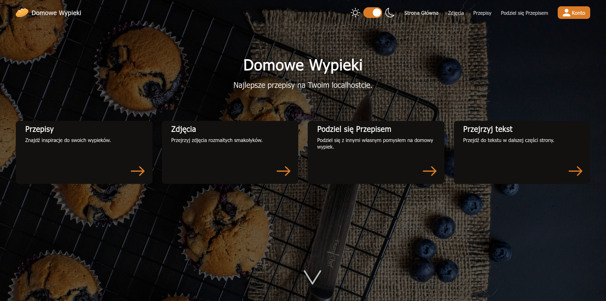
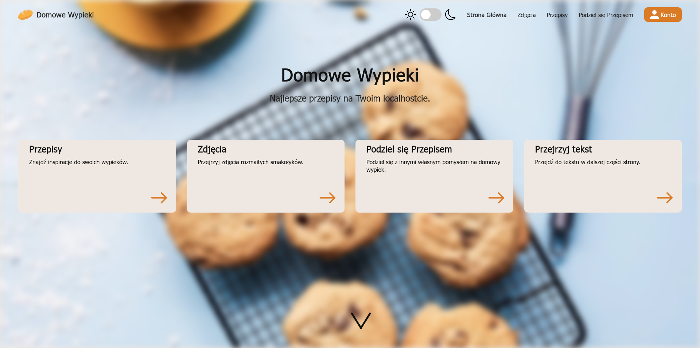
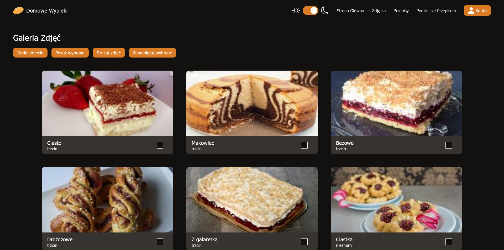

# Wypieki

Strona o wypiekach napisana w PHP z wykorzystaniem wzorca MVC i MongoDB, oraz Typescript i JQuery na frontendzie.
Wspiera tworzenie kont, zapamiętywanie polubionych zdjęć oraz jasny i ciemny motyw.

## Strona główna




## Galeria



## Uruchamianie

```
composer install
```

W wypadku korzystania z serwera `Apache`, należy ustawić `DocumentRoot` na src/web. Znajduje się tam plik `.htaccess`, który przekieruje wszystkie zapytania HTTP do `src/core/FrontController.php`.
